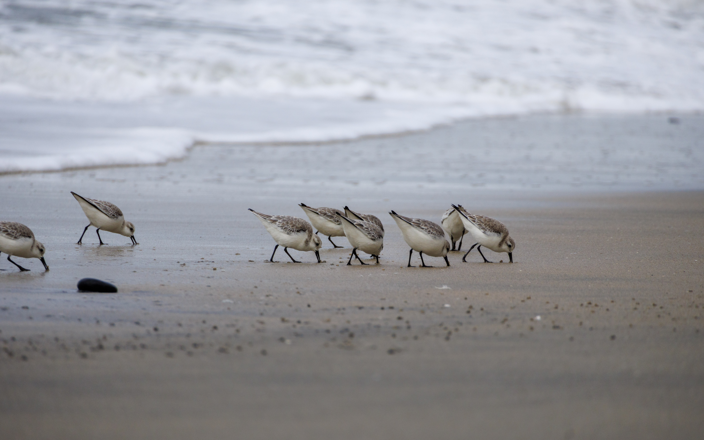
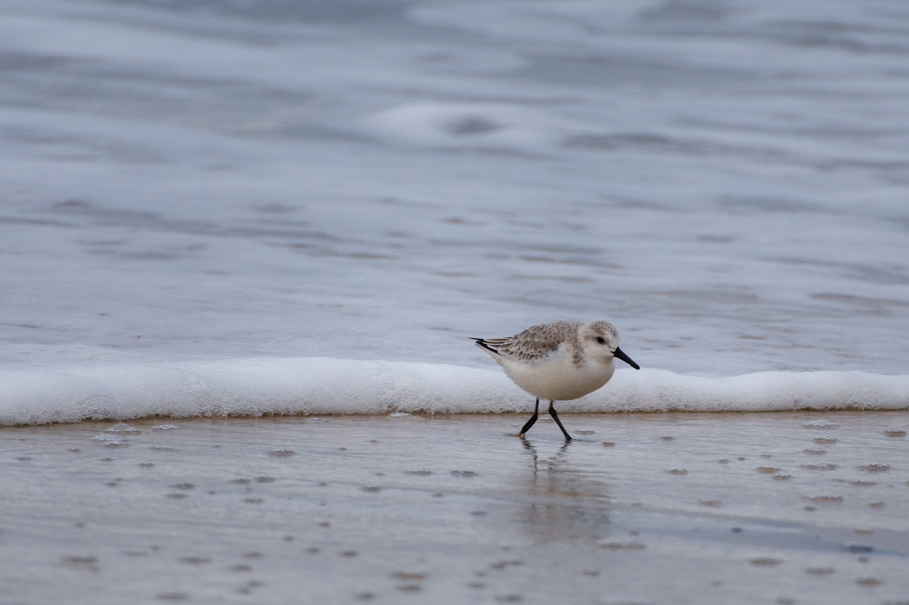

Sanderlings are small, plump shorebirds found along sandy beaches and coastal areas. If you've ever seen them, you probably remember them for the silly and intense manner in which they skitter back and forth with the waves.

I first spotted a sanderling around Christmastime on the beach in La Jolla. Its speedy, delicate little legs looked like they ought to make cartoon tinkling sounds as it zipped along the sand. It was small--about the size of a sparrow--with pale sandy gray and white plumage. I'm told this helps them blend in.

Unfortunately, they're so good at blending in that even when you spot one, you can't be sure you've seen a sanderling without a picture and a birding handbook. They're _very_ easy to mistake for a number of other shorebirds.

In fact, when I first started photographing them, an elderly couple out for a stroll happened to notice my excitement and apparently evident confusion, and told me they were snowy plovers--their favorite to watch in the mornings. After a quick check in my bird guide, I confirmed they were indeed sanderlings.

